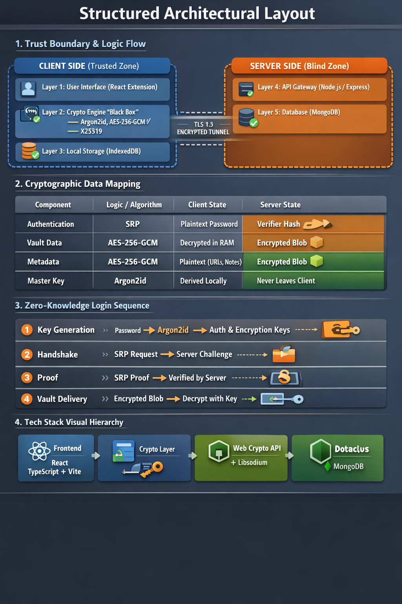

# Zero-Knowledge Security Vault

**A client-side encrypted, zero-knowledge password manager that keeps your secrets secret — even from the server.**

Secure password & secret storage with **true end-to-end encryption**, **zero-knowledge authentication**, and **metadata privacy**.  
The server only sees encrypted blobs — never passwords, keys, site names, notes, or any plaintext data.

Built primarily as a **browser extension** (with partial mobile support planned).

## Why This Project?

Most password managers trust the server (or the company) with at least some of your data.  
This project **does not**.

- Master password and encryption keys **never leave your device**
- Server compromise reveals only useless encrypted blobs
- Website names, usernames, notes, and even metadata are encrypted
- Designed to resist phishing, memory scraping, network interception, and backend breaches

## Core Security Goals

- True zero-knowledge authentication (no password ever sent)
- End-to-end encryption of all vault contents and metadata
- Secure cross-device sync without server-side decryption
- Protection against common password manager attack vectors
- Clean, modular, and well-tested code

## Architecture – High Level

**Key rule**: The backend is **completely blind**. It never sees:

- Your master password
- Any encryption keys
- Website URLs / names
- Usernames, notes, or any secret content

## Cryptographic Primitives

| Purpose                  | Algorithm / Protocol       | Where executed     | Notes                              |
|--------------------------|----------------------------|--------------------|------------------------------------|
| Key derivation           | Argon2id                   | Client             | Memory-hard, side-channel resistant|
| Symmetric encryption     | AES-256-GCM                | Client             | Authenticated encryption           |
| Zero-knowledge auth      | Secure Remote Password (SRP)| Client ↔ Server   | No password sent over network      |
| 2FA                      | TOTP (RFC 6238)            | Server-side check  | Optional                           |
| Secure sharing           | X25519 key exchange + AES-GCM | Client          | Future feature                     |
| Integrity & authenticity | Ed25519 digital signatures | Client             | Protects against tampering         |

## Current Status & Roadmap (Sprints)

| Sprint | Focus Area                          | Status     | Highlights                                      |
|--------|-------------------------------------|------------|-------------------------------------------------|
| 1      | Cryptographic foundation            | Completed  | Argon2id, AES-GCM, SRP implementation           |
| 2      | Blind backend & sync APIs           | In progress| Encrypted-only storage, TOTP 2FA                |
| 3      | Browser extension basics            | Planned    | Manifest V3, vault unlock UI, memory safety     |
| 4      | Autofill & auto-capture             | Planned    | Secure field detection & injection              |
| 5      | Mobile port (React Native)          | Partial    | Biometrics, offline storage, Android autofill   |
| 6      | Security hardening & extras         | Future     | Breach monitoring, emergency kit, sharing       |

## How Zero-Knowledge Login Works

1. User enters master password
2. Client derives:
   - Long-term SRP verifier key (via Argon2id)
   - Vault encryption key
3. Client performs SRP proof → server verifies without ever seeing password
4. On success: client decrypts vault locally
5. All future operations happen client-side

→ **Password never leaves the device.**

## Synchronization & Conflict Handling

- Vault encrypted → server stores opaque blobs + timestamps
- Client uploads only encrypted changes
- Offline edits are queued locally
- On conflict → user chooses which version to keep (no automatic CRDT yet)

## Important Security Features

### Memory Safety (JavaScript constraints)

- Keys stored in isolated variables only
- Explicit zeroing after use (best-effort)
- Auto-lock after inactivity / tab close / system sleep

### Network Security

- TLS 1.3 enforced everywhere
- Certificate pinning (planned)
- No plaintext credentials in transit

### Metadata Protection

- Website URLs, names, icons, notes → all encrypted
- Client-side search & sorting only

## Testing & Verification Approach

- Known-answer tests for crypto primitives
- Simulated network attacks (MITM, replay)
- Memory inspection after forced crashes
- Offline/online sync stress tests
- Dependency vulnerability scanning

## Limitations & Honest Warnings

- JavaScript cannot guarantee secure memory wiping (best-effort only)
- Clipboard copy is inherently visible to other extensions
- Mobile version is currently partial / experimental
- Conflict resolution requires manual user decision
- Not yet audited by professional cryptographers/security firms

→ This is currently an **educational / proof-of-concept** project.

## Tech Stack

- **Frontend**: React, Chrome Extension (Manifest V3)
- **Crypto**: Web Crypto API + argon2-browser / noble-srp / tweetnacl
- **Backend**: Node.js, Express, MongoDB
- **Mobile**: React Native (partial)
- **Others**: TypeScript, Vite, Docker

## License

**Educational / Academic use only**  
This project is developed strictly for learning, experimentation, and demonstration of zero-knowledge principles.

**Not intended for production use without independent security audit.**

---

Thank you for reading!  
Feedback, questions, and constructive criticism are very welcome.