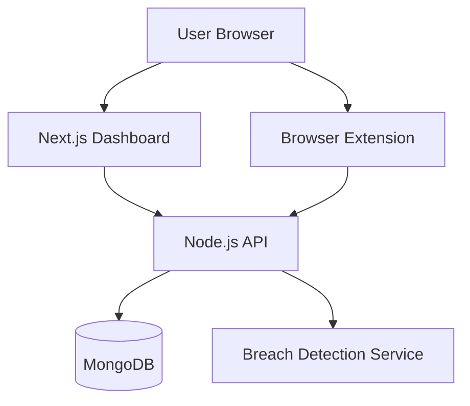
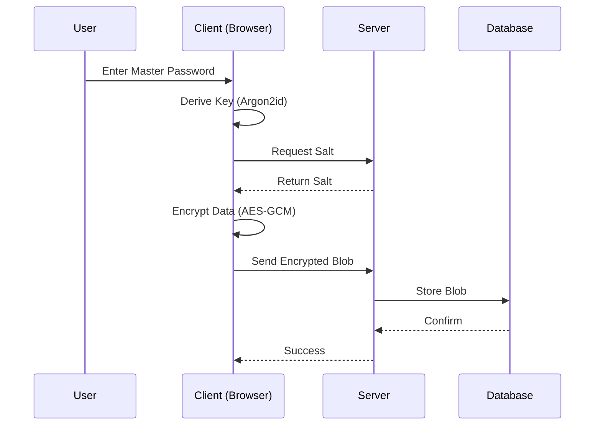

# Architecture & Design

This document covers the technical architecture, security protocols, and UML diagrams for the system.

## Table of Contents
1.  [Zero-Knowledge Encryption](#zero-knowledge-encryption)
2.  [Breach Detection (k-Anonymity)](#breach-detection-k-anonymity)
3.  [Blind Sync Protocol](#blind-sync-protocol)
4.  [UML Diagrams](#uml-diagrams)

---

## Zero-Knowledge Encryption

1.  **User Input**: User types `Master Password`.
2.  **Key Derivation**: `Argon2id` hashes the password with a random salt (100MB memory cost, 4 iterations). Result: `Derived Key`.
3.  **Encryption**: `AES-256-GCM` uses `Derived Key` to encrypt vault data. Result: `Ciphertext`.
4.  **Storage**: `Ciphertext` is sent to MongoDB. The server **never** sees the `Master Password` or `Derived Key`.

## Breach Detection (k-Anonymity)

1.  **Hashing**: The system hashes the user's email/username (SHA-1/SHA-256).
2.  **Prefixing**: Only the **first 5 characters** of the hash are sent to the Breach API.
3.  **Matching**: The API returns all breaches matching that prefix.
4.  **Local Filtering**: The client checks the full hash against the returned list locally.
    *   _Result:_ The API server never knows exactly which account you are checking along the k-anonymity set.

## Blind Sync Protocol

The server acts as a "dumb store". It handles versioning and conflict resolution based on `vaultVersion` numbers, but it cannot merge the _content_ because it is encrypted. Conflic resolution pushes the newer version or asks client to resolve.

---

## UML Diagrams

### System Component Diagram

### Encryption Flow Sequence

